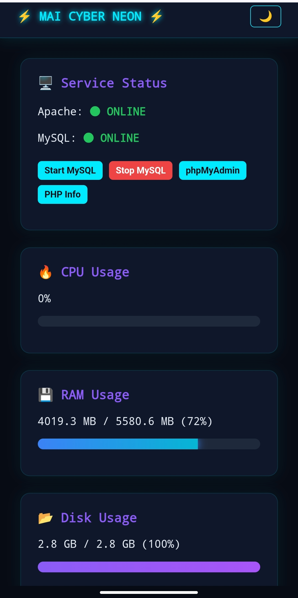

# ⚡ MAI AAMP Cyber OS

> Muhammad Aripin Interface – AAMP Stack for Termux  
> Apache + PHP + MariaDB + phpMyAdmin + Cyber Control Menu

---

## 🖥 Preview Dashboard

<p align="center">
  
</p>

Cyber Neon Dashboard dengan:

- Status Service Real-Time
- Menu Control Interaktif
- Start / Stop Service
- Tampilan Terminal Style

## 🚀 Tentang Project

MAI AAMP adalah installer otomatis untuk menjalankan stack:

- Apache (via php-apache)
- PHP
- MariaDB
- phpMyAdmin
- Custom MAI Dashboard
- Cyber Terminal Control Menu

Didesain untuk Termux Android dengan tampilan interaktif dan menu kontrol service.

---

## 🔥 Fitur

- ✨ Cyber banner & boot animation
- 🔐 Konfirmasi install (tekan 1 & 10)
- 📊 Progress bar animasi
- 📁 Setup otomatis `/storage/emulated/0/htdocs`
- 🌐 Custom `httpd.conf`
- 🛠 Auto setup phpMyAdmin
- 🎛 Command global `mai`
- 🟢 Status service warna hijau / merah
- ▶ Start Apache / MySQL
- ⏹ Stop Apache / MySQL
- 🛑 Stop semua service
- 💣 Uninstall AAMP
- 🧹 Installer auto delete setelah selesai

---

## ⚡ Cara Install

Jalankan di Termux:

```bash
pkg update && pkg installer curl -y
curl -fsSL https://raw.githubusercontent.com/aripin-ilham/mai-aamp/main/installer.sh | bash
```

---

## 🎛 Cara Menggunakan

Setelah instalasi selesai:

Masuk ke menu dengan:

```bash
mai
```

Menu akan menampilkan:

- Status MySQL
- Status Apache
- Start / Stop service
- Stop semua
- Uninstall AAMP

---

## 🌐 Akses Localhost

Buka browser dan akses:

```
http://localhost:8080
```

phpMyAdmin:

```
http://localhost:8080/phpmyadmin
```

---

## 🧹 Uninstall

Bisa dari menu `mai`  
Atau manual:

```bash
mai
```

Pilih:
```
Uninstall AAMP
```

---

## ⚠ Catatan

- Hanya untuk Termux
- Port default: 8080
- Storage harus diizinkan saat install

---

## 👨‍💻 Creator

Muhammad Aripin  
MAI Channel  

GitHub: https://github.com/aripin-ilham

---

## ⭐ Support

Jika project ini membantu, jangan lupa kasih ⭐ di repo ini.
